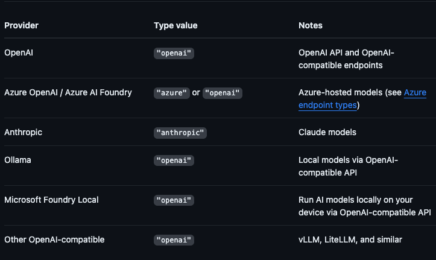

## For Observability/metrics shown in the UI

The kagent Dashboard reads from ClickHouse, which is fed by the `solo-enterprise-telemetry-collector` (in the `kagent` namespace). The collector receives OTLP spans + access logs from agentgateway. Two resources need to exist for the dashboard to populate:

1. An `EnterpriseAgentgatewayPolicy` attached to the Gateway you want traced, with both `tracing` and `accessLog` configured to ship to the collector, **and** with the right CEL attributes so MCP tool names, LLM model names, and token counts land in ClickHouse.
2. A `ReferenceGrant` in the `kagent` namespace allowing cross-namespace reference to the collector Service.

The policy below is the one actually attached to `mcp-gateway` in the demo cluster. It captures:
- **MCP attributes** for the `Tool Requests` dashboard panel (`gen_ai.tool.name`, `mcp.tool_name`, `mcp.tool_target`, `mcp.method_name`, `mcp.session_id`).
- **LLM attributes** for the `Token Usage By Model` and `Tokens Used` panels (`llm.provider`, `llm.request_model`, `llm.response_model`, `llm.input_tokens`, `llm.output_tokens`, `llm.total_tokens`).
- **HTTP attributes** for the `Requests Over Time` and `Errors Over Time` panels (status codes, paths — these come from access log defaults).

```yaml
apiVersion: enterpriseagentgateway.solo.io/v1alpha1
kind: EnterpriseAgentgatewayPolicy
metadata:
  name: mcp-gateway-tracing
  namespace: agentgateway-system
spec:
  targetRefs:
    - group: gateway.networking.k8s.io
      kind: Gateway
      name: mcp-gateway
  frontend:
    tracing:
      backendRef:
        group: ""
        kind: Service
        name: solo-enterprise-telemetry-collector
        namespace: kagent
        port: 4317
      protocol: GRPC
      clientSampling: "true"
      randomSampling: "true"
      resources:
        - { name: service.name,                 expression: '"mcp-gateway"' }
        - { name: deployment.environment.name,  expression: '"demo"' }
      attributes:
        add:
          - { name: request.host,        expression: 'request.host' }
          - { name: mcp.method_name,     expression: 'default(mcp.methodName, "")' }
          - { name: mcp.session_id,      expression: 'default(mcp.sessionId, "")' }
          - { name: mcp.tool_name,       expression: 'default(mcp.tool.name, "")' }
          - { name: backend.name,        expression: 'default(backend.name, "")' }
          - { name: llm.provider,        expression: 'default(llm.provider, "")' }
          - { name: llm.request_model,   expression: 'default(llm.requestModel, "")' }
          - { name: llm.response_model,  expression: 'default(llm.responseModel, "")' }
          - { name: llm.input_tokens,    expression: 'default(llm.inputTokens, 0)' }
          - { name: llm.output_tokens,   expression: 'default(llm.outputTokens, 0)' }
          - { name: llm.total_tokens,    expression: 'default(llm.totalTokens, 0)' }
    accessLog:
      otlp:
        backendRef:
          group: ""
          kind: Service
          name: solo-enterprise-telemetry-collector
          namespace: kagent
          port: 4317
        protocol: GRPC
      attributes:
        add:
          - { name: gen_ai.tool.name,    expression: 'default(mcp.tool.name, "")' }
          - { name: mcp.tool_name,       expression: 'default(mcp.tool.name, "")' }
          - { name: mcp.tool_target,     expression: 'default(mcp.tool.target, "")' }
          - { name: mcp.method_name,     expression: 'default(mcp.methodName, "")' }
          - { name: llm.provider,        expression: 'default(llm.provider, "")' }
          - { name: llm.request_model,   expression: 'default(llm.requestModel, "")' }
          - { name: llm.response_model,  expression: 'default(llm.responseModel, "")' }
          - { name: llm.input_tokens,    expression: 'default(llm.inputTokens, 0)' }
          - { name: llm.output_tokens,   expression: 'default(llm.outputTokens, 0)' }
          - { name: llm.total_tokens,    expression: 'default(llm.totalTokens, 0)' }
---
# In the kagent namespace — allow the agentgateway-system policy above to
# reference the telemetry collector Service across namespaces.
apiVersion: gateway.networking.k8s.io/v1beta1
kind: ReferenceGrant
metadata:
  name: allow-agentgateway-otel-access
  namespace: kagent
spec:
  from:
    - { group: enterpriseagentgateway.solo.io, kind: EnterpriseAgentgatewayPolicy, namespace: agentgateway-system }
  to:
    - { group: "", kind: Service, name: solo-enterprise-telemetry-collector }
```

**Important:** the `llm.*` attributes only populate when traffic flows through an **AI-type backend** (`spec.ai.provider.*` on the backend). If traffic instead flows through a plain `Service` backend (e.g. an in-cluster LLM proxy), agentgateway has no way to parse the request as an LLM call and these attributes stay empty — leaving the `Tokens Used` and `Token Usage By Model` panels showing zero. For the dashboard to populate fully, route LLM traffic to an AI backend (Anthropic, OpenAI, etc.) on the same gateway this policy targets.

If you target a different Gateway, change `spec.targetRefs[0].name`, the `service.name` resource expression, and the policy `metadata.name` to match.

## Gateway Setup

1. Create a gateway for the MCP server you deployed
```
kubectl apply -f - <<EOF
apiVersion: gateway.networking.k8s.io/v1
kind: Gateway
metadata:
  name: mcp-gateway
  namespace: agentgateway-system
  labels:
    app: github-mcp-server
spec:
  gatewayClassName: enterprise-agentgateway
  listeners:
    - name: mcp
      port: 3000
      protocol: HTTP
      allowedRoutes:
        namespaces:
          from: Same
EOF
```

2. Create a Kubernetes `Secret` holding your GitHub PAT. The value must be the full `Authorization` header (prefixed with `Bearer `), stored under the key `Authorization` — agentgateway uses this value verbatim as the header on upstream requests.

```
export GITHUB_PAT=

kubectl apply -f - <<EOF
apiVersion: v1
kind: Secret
metadata:
  name: github-pat
  namespace: agentgateway-system
type: Opaque
stringData:
  Authorization: "Bearer ${GITHUB_PAT}"
EOF
```

3. Deploy a backend so the gateway knows what to route to. In this case, its the github copilot MCP server
```
kubectl apply -f - <<EOF
apiVersion: enterpriseagentgateway.solo.io/v1alpha1
kind: EnterpriseAgentgatewayBackend
metadata:
  name: github-mcp-server
  namespace: agentgateway-system
spec:
  entMcp:
    toolMode: Standard
    targets:
      - name: github-copilot
        static:
          host: api.githubcopilot.com
          port: 443
          path: /mcp/
          protocol: StreamableHTTP
          policies:
            tls: {}
            auth:
              secretRef:
                name: github-pat
EOF
```


4. Add a Kubernetes Secret holding your Anthropic API key.

```
export ANTHROPIC_API_KEY=

kubectl apply -f - <<EOF
apiVersion: v1
kind: Secret
metadata:
  name: anthropic-api-key
  namespace: agentgateway-system
type: Opaque
stringData:
  Authorization: "Bearer ${ANTHROPIC_API_KEY}"
EOF
```

5. Create an `EnterpriseAgentgatewayBackend` of type `ai` for Anthropic.

```
kubectl apply -f - <<EOF
apiVersion: enterpriseagentgateway.solo.io/v1alpha1
kind: EnterpriseAgentgatewayBackend
metadata:
  labels:
    app: agentgateway-route
  name: anthropic
  namespace: agentgateway-system
spec:
  ai:
    provider:
      anthropic:
        model: "claude-sonnet-4-6"
  policies:
    ai:
      # store model internal state instead of re-tokenzing for a prompt
      promptCaching: {}
    auth:
      secretRef:
        name: anthropic-api-key
EOF
```

6. Create the `HTTPRoute` to route by path.

```
kubectl apply -f - <<EOF
apiVersion: gateway.networking.k8s.io/v1
kind: HTTPRoute
metadata:
  name: mcp-route
  namespace: agentgateway-system
  labels:
    app: github-mcp-server
spec:
  parentRefs:
    - name: mcp-gateway
  rules:
    - matches:
        - path:
            type: PathPrefix
            value: /anthropic
      filters:
        - type: URLRewrite
          urlRewrite:
            path:
              type: ReplaceFullPath
              replaceFullPath: /v1/chat/completions
      backendRefs:
        - name: anthropic
          namespace: agentgateway-system
          group: enterpriseagentgateway.solo.io
          kind: EnterpriseAgentgatewayBackend
    - matches:
        - path:
            type: PathPrefix
            value: /mcp
      backendRefs:
        - name: github-mcp-server
          namespace: agentgateway-system
          group: enterpriseagentgateway.solo.io
          kind: EnterpriseAgentgatewayBackend
EOF
```

### Test Connectivity

Capture the IP of the gateway
```
export GATEWAY_IP=$(kubectl get svc mcp-gateway -n agentgateway-system -o jsonpath='{.status.loadBalancer.ingress[0].ip}')
echo $GATEWAY_IP
```

**To test LLM traffic**

Anthropic's Messages API requires `model`, `max_tokens`, and a `messages` array. The system prompt belongs at the top level (not inside `messages`). Do **not** set the `x-api-key` or `Authorization` header here — the gateway injects it from the `anthropic-api-key` Secret.

```
curl "http://$GATEWAY_IP:3000/anthropic" \
  -H "content-type: application/json" \
  -H "anthropic-version: 2023-06-01" \
  -d '{
    "system": "You are a skilled cloud-native network engineer.",
    "messages": [
      {
        "role": "user",
        "content": "Write me a paragraph containing the best way to think about Istio Ambient Mesh"
      }
    ]
  }' | jq
```


**To test MCP**, open MCP Inspector
```
npx modelcontextprotocol/inspector#0.18.0
```

Specify, within the **URL** section, the following:
```
http://YOUR_ALB_IP:3000/mcp
```

With progressive disclosure, On `tools/list` you should see only `get_tool` and `invoke_tool` instead of the full GitHub MCP tool set. Call `get_tool` with e.g. `{"name": "list_issues"}` to fetch a specific tool's schema, then `invoke_tool` to execute it.

## BYOK

BYOK (Bring Your Own Key) lets the GitHub Copilot SDK authenticate to your chosen LLM provider (OpenAI, Anthropic, Gemini, Azure OpenAI, etc.) using **your** API key instead of GitHub-managed credentials. The Copilot SDK reads the key from its provider configuration and signs LLM requests with it directly.

[Supported providers as of May, 2026](https://docs.github.com/en/copilot/how-tos/copilot-sdk/authenticate-copilot-sdk/bring-your-own-key)




- **One key, many models.** The Copilot SDK doesn't need a separate key for OpenAI, Anthropic, Bedrock. Agentgateway fronts all of them. Add a provider, no SDK change.
- **Per-user / per-team controls.** RBAC, rate limits, audit by JWT claim or header, which is invisible to the SDK.
- **Model aliasing.** The SDK requests `"smart"` or `"default"`; agentgateway resolves to the concrete model. Easy to swap models without redeploying anything client-side.
- **Failover.** OpenAI degrades → traffic shifts to Anthropic. SDK sees no change.


This end-to-end demo covers the customer's OpenAI key lives in a Kubernetes `Secret` inside agentgateway; the Copilot SDK only knows about the gateway.

**1. Upstream provider key as a Secret (the only place it lives):**

```bash
export OPENAI_API_KEY=sk-proj-...   # your real OpenAI key
```

```bash
kubectl apply -f - <<EOF
apiVersion: v1
kind: Secret
metadata:
  name: openai-api-key
  namespace: agentgateway-system
type: Opaque
stringData:
  Authorization: "Bearer ${OPENAI_API_KEY}"
EOF
```

The value under `Authorization` is used verbatim as the upstream `Authorization` header, so the `Bearer ` prefix is required for OpenAI to accept the call.

**2. Gateway listener (where the Copilot SDK connects):**

```bash
kubectl apply -f - <<EOF
apiVersion: gateway.networking.k8s.io/v1
kind: Gateway
metadata:
  name: byok-gateway
  namespace: agentgateway-system
spec:
  gatewayClassName: enterprise-agentgateway
  listeners:
    - name: openai-compat
      port: 80
      protocol: HTTP
      allowedRoutes:
        namespaces:
          from: Same
EOF
```

**3. AI Backend pointing at OpenAI, with the upstream credential attached inline:**

This mirrors the pattern used by the live `anthropic` backend in the **MCP Tool Selection** section — `auth.secretRef` lives on the Backend itself under `spec.policies.auth`. No separate `EnterpriseAgentgatewayPolicy` is needed for credential attachment.

```bash
kubectl apply -f - <<EOF
apiVersion: enterpriseagentgateway.solo.io/v1alpha1
kind: EnterpriseAgentgatewayBackend
metadata:
  name: byok-openai
  namespace: agentgateway-system
spec:
  ai:
    provider:
      openai: {} # model taken from request
      # no host/port → defaults to api.openai.com:443
  policies:
    auth:
      secretRef:
        name: openai-api-key
EOF
```

**4. HTTPRoute wiring the Gateway to the Backend:**

Use the Enterprise CRD group (`enterpriseagentgateway.solo.io` / `EnterpriseAgentgatewayBackend`) in `backendRefs` to match the Backend created in step 3. Mixing the OSS group (`gateway.agentgateway.dev` / `AgentgatewayBackend`) here will produce `ResolvedRefs=False` on the HTTPRoute and 404s on requests.

```bash
kubectl apply -f - <<EOF
apiVersion: gateway.networking.k8s.io/v1
kind: HTTPRoute
metadata:
  name: byok-openai-route
  namespace: agentgateway-system
spec:
  parentRefs:
    - name: byok-gateway
  rules:
    - matches:
        - path:
            type: PathPrefix
            value: /v1
      backendRefs:
        - group: enterpriseagentgateway.solo.io
          kind: EnterpriseAgentgatewayBackend
          name: byok-openai
          namespace: agentgateway-system
EOF
```

**5. Point the Copilot CLI at the gateway, NOT at OpenAI:**

```bash
export GW_IP=$(kubectl get svc byok-gateway -n agentgateway-system \
  -o jsonpath='{.status.loadBalancer.ingress[0].ip}')

COPILOT_PROVIDER_BASE_URL="http://${GW_IP}/v1" \
COPILOT_PROVIDER_TYPE=openai \
COPILOT_PROVIDER_API_KEY=ignored-by-gateway \
COPILOT_MODEL=gpt-4o-mini \
copilot -p "Say HELLO from BYOK." --allow-all
```

`COPILOT_PROVIDER_API_KEY` is what the CLI presents to **agentgateway** — not the OpenAI key. It can be an internal JWT, a shared API key the gateway is configured to accept, or any string when the listener has no auth policy (as in this demo). The real `sk-proj-…` lives only in the `openai-api-key` Secret and never touches the client environment.

**6. Smoke test (curl, no CLI needed):**

```bash
export GW_IP=$(kubectl get svc byok-gateway -n agentgateway-system \
  -o jsonpath='{.status.loadBalancer.ingress[0].ip}')

curl -sS "http://${GW_IP}/v1/chat/completions" \
  -H 'Content-Type: application/json' \
  -d '{
    "model": "gpt-4o-mini",
    "messages": [{"role":"user","content":"Say hello from BYOK."}]
  }' | jq -r '.model, .choices[0].message.content'
```

If you see `"gpt-4o-mini"` followed by a normal completion, the path **Copilot CLI → agentgateway → OpenAI** is working and the client has zero knowledge of `sk-proj-…`. To see the same observability attributes (`gen_ai.provider.name=openai`, `gen_ai.request.model`, token counts) that the Anthropic/Copilot demo emits, tail the dataplane:

```bash
DATAPLANE=$(kubectl get pods -n agentgateway-system \
  -l gateway.networking.k8s.io/gateway-name=byok-gateway -o name | head -1)
kubectl logs -n agentgateway-system $DATAPLANE | grep "protocol=llm"
```

## OBO

On-Behalf-Of (OBO) is the pattern where an agent makes downstream calls carrying **two identities** at once:

- **`sub`** — the user the agent is acting for
- **`act`** — the agent itself (RFC 8693)

The downstream service (a tool, an MCP server, an API) can then enforce policy on either or both. This is what makes "agent identity" tangible — without OBO, downstream services only see the agent and lose the human, or only see the human and lose the agent.

### OBO Flow

The canonical pattern in this stack is **IdP-driven OBO**: kagent passes the user's raw OIDC/IdP access token through to agentgateway, and **agentgateway's STS performs the token exchange against the IdP** before forwarding to the downstream backend. kagent does not mint OBO tokens itself in this configuration (`SKIP_OBO=true`); the IdP is the sole minter of identity and the STS is the sole exchanger.

```
┌──────────┐  1. Login (OIDC PKCE)        ┌────────────────┐
│  User    │ ───────────────────────────▶ │     IdP        │
│ (Alice)  │ ◀─────────────────────────── │ (Entra today)  │
└────┬─────┘  user access token (sub=alice)└────────────────┘
     │
     │  2. user token in Authorization
     ▼
┌────────────────┐
│   kagent UI    │  SKIP_OBO=true → forwards raw user token
│   + runtime    │
└────────┬───────┘
         │  3. user token in Authorization
         │     (KAGENT_PROPAGATE_TOKEN=true on the Agent)
         ▼
┌─────────────────────────────────────────────────────────────┐
│                       agentgateway                          │
│                                                             │
│  dataplane ──── STS_URI ────▶  STS (port 7777)              │
│    │                              │                         │
│    │                              │  4. POST /token         │
│    │                              │     (grant_type=        │
│    │                              │      jwt-bearer)        │
│    │                              ▼                         │
│    │                          ┌────────┐                    │
│    │                          │  IdP   │  5. exchanged      │
│    │                          │ /token │     token scoped   │
│    │                          └────────┘     to downstream  │
│    │                              │                         │
│    │     ◀──────────────────────  │                         │
│    │   exchanged token (sub=user, aud=downstream client)    │
│    │                                                        │
└────┼────────────────────────────────────────────────────────┘
     │  6. exchanged token in Authorization
     ▼
┌────────────────┐    7. provider-native auth (API key)
│ llm-obo-proxy  │ ──────────────────────────▶  Anthropic / OpenAI
│  (validates    │
│  exchanged     │
│  token)        │
└────────────────┘
```

**Key properties to point at on stage:**

- kagent never mints its own JWT in this topology. The IdP's token flows untouched through kagent and through the agent.
- The STS lives inside the agentgateway controller pod (`enterprise-agentgateway` Deployment, port 7777). The dataplane pod calls it via `STS_URI` injected from `EnterpriseAgentgatewayParameters`.
- The exchange call is **agentgateway → IdP /token endpoint**, not agentgateway → some internal mint. For Entra it's `grant_type=urn:ietf:params:oauth:grant-type:jwt-bearer` (Microsoft's flavor); for an RFC 8693-compliant IdP it's `grant_type=urn:ietf:params:oauth:grant-type:token-exchange`.
- The exchanged token is what the downstream backend validates. The proxy validates the IdP-issued exchanged token, not anything agentgateway issued itself. In some cases, it may be a k8s Service because due to some changes with LLM providers (e.g - Anthropic), they don't want you using "third-party", so the request gets blocked on the LLM providers end.


### OBO Flow demo: kagent + Entra

kagent + entra for OBO flow. If you're using another OIDC/iDP provider, please note that the overall concepts are the same. Its just a matter of having a different issuer.

To configure OBO, you can use the following as an example if you want to use Entra: https://github.com/AdminTurnedDevOps/agentic-demo-repo/blob/main/kagent-enterprise/obo/setup.md

#### What's wired up right now

If you followed the Entra guide above in the **OBO Flow Demo: kagent + Entra** section, your "state of the world" will look like the below:

```bash
# 1. kagent is configured with Entra OIDC and SKIP_OBO=true
kubectl get configmap kagent-enterprise-config -n kagent -o yaml \
  | grep -E "OIDC_ISSUER|OIDC_CLIENT_ID|OBO_CLAIMS_TO_PROPAGATE|SKIP_OBO"

# Expected:
#   OIDC_ISSUER:             https://login.microsoftonline.com/<TENANT_ID>/v2.0
#   OIDC_CLIENT_ID:          <KAGENT_BACKEND_CLIENT_ID>
#   OBO_CLAIMS_TO_PROPAGATE: email,groups,oid,tid,upn
#   SKIP_OBO:                "true"

# 2. The demo agent has KAGENT_PROPAGATE_TOKEN=true
kubectl get deploy obo-demo-agent -n kagent \
  -o jsonpath='{range .spec.template.spec.containers[*].env[?(@.name=="KAGENT_PROPAGATE_TOKEN")]}{.name}={.value}{"\n"}{end}'
# KAGENT_PROPAGATE_TOKEN=true

# 3. The agentgateway STS is configured with Entra as the subject validator,
#    and the dataplane has STS_URI/STS_AUTH_TOKEN injected.
kubectl get enterpriseagentgatewayparameters agentgateway-entra-testing-enterprise \
  -n agentgateway-system -o jsonpath='{.spec.env}' | jq .
# [
#   { "name": "STS_URI",        "value": "http://enterprise-agentgateway.agentgateway-system.svc.cluster.local:7777/token" },
#   { "name": "STS_AUTH_TOKEN", "value": "/var/run/secrets/xds-tokens/xds-token" }
# ]

# 4. The per-backend OBO exchange policy targets the llm-obo-proxy Service.
kubectl get enterpriseagentgatewaypolicy entra-obo-token-exchange \
  -n agentgateway-system -o yaml | sed -n '/spec:/,/status:/p'
# spec:
#   backend:
#     tokenExchange:
#       entra:
#         tenantId:  <TENANT_ID>
#         clientId:  <KAGENT_BACKEND_CLIENT_ID>
#         scope:     api://<KAGENT_BACKEND_CLIENT_ID>/kagent-backend
#         clientSecretRef: { key: client_secret, name: entra-obo-client-secret }
#       mode: ExchangeOnly
#   targetRefs:
#     - { group: "", kind: Service, name: llm-obo-proxy }
```

These four resources are the whole OBO control surface. Everything else (Gateway, HTTPRoute, llm-obo-proxy Deployment) is plain Kubernetes plumbing.

#### Evidence the chain is working

After driving a request through the kagent UI to the `obo-demo-agent`, you can confirm each hop:

```bash
kubectl logs deployment/enterprise-agentgateway -n agentgateway-system \
  | grep '"path":"/token"' | tail -5
# {"…","method":"POST","path":"/token","status_code":200,…}

kubectl logs deployment/llm-obo-proxy -n agentgateway-system \
  | grep -v healthz | tail -6
# INFO:llm-obo-proxy:validated token for oid=<USER_OID> aud=<KAGENT_BACKEND_CLIENT_ID> scp=kagent-backend
# INFO:httpx:HTTP Request: POST https://api.anthropic.com/v1/messages "HTTP/1.1 200 OK"
```

What this tells you concretely:

- **`oid=<USER_OID>`**: The human user's Entra object ID is present in the token the proxy validates. The user's identity made it all the way to the downstream proxy.
- **`aud=<KAGENT_BACKEND_CLIENT_ID>` + `scp=kagent-backend`**: This is an **Entra-issued** token, scoped to the `kagent-backend` app registration. agentgateway did call Entra's `/token` endpoint and received back a fresh, audience-restricted token. The proxy refuses to accept tokens with the wrong audience.
- **The next log line is `POST https://api.anthropic.com/v1/messages 200`**: Only after the OBO token validates does the proxy call Anthropic with the provider API key. No identity, no call.

#### The four CRDs that make this work

(Full YAML in `setup.md` via the **OBO Flow Demo: kagent + Entra** section; these are the headline shapes.)

**a. Helm values for the agentgateway controller — turns on the STS:**

```yaml
tokenExchange:
  enabled: true
  issuer: "http://enterprise-agentgateway.agentgateway-system.svc.cluster.local:7777"
  subjectValidator:
    validatorType: "remote"
    remoteConfig:
      url: "https://login.microsoftonline.com/${TENANT_ID}/discovery/v2.0/keys"
  apiValidator:   { validatorType: "k8s" }
  actorValidator: { validatorType: "k8s" }
```

**b. `EnterpriseAgentgatewayParameters` — passes STS endpoint to the dataplane:**

```yaml
apiVersion: enterpriseagentgateway.solo.io/v1alpha1
kind: EnterpriseAgentgatewayParameters
metadata: { name: agentgateway-entra-testing-enterprise, namespace: agentgateway-system }
spec:
  env:
    - { name: STS_URI,        value: "http://enterprise-agentgateway.agentgateway-system.svc.cluster.local:7777/token" }
    - { name: STS_AUTH_TOKEN, value: "/var/run/secrets/xds-tokens/xds-token" }
```

The `Gateway` references this via `spec.infrastructure.parametersRef`.

**c. `EnterpriseAgentgatewayPolicy` — declares "do an Entra OBO exchange before calling this backend":**

```yaml
apiVersion: enterpriseagentgateway.solo.io/v1alpha1
kind: EnterpriseAgentgatewayPolicy
metadata: { name: entra-obo-token-exchange, namespace: agentgateway-system }
spec:
  targetRefs:
    - { kind: Service, name: llm-obo-proxy, group: "" }
  backend:
    tokenExchange:
      mode: ExchangeOnly
      entra:
        tenantId: "${TENANT_ID}"
        clientId: "${KAGENT_BACKEND_CLIENT_ID}"
        scope:    "api://${KAGENT_BACKEND_CLIENT_ID}/kagent-backend"
        clientSecretRef: { name: entra-obo-client-secret, key: client_secret }
```

This is the field that triggers the agentgateway → Entra `/token` call. **It is Entra-specific** — see "Adapting to Keycloak" below.

**d. The kagent `Agent` — `KAGENT_PROPAGATE_TOKEN=true`:**

```yaml
apiVersion: kagent.dev/v1alpha2
kind: Agent
metadata: { name: obo-demo-agent, namespace: kagent }
spec:
  type: Declarative
  declarative:
    modelConfig: anthropic-model-config         # baseUrl points at agentgateway /llm route
    deployment:
      env:
        - { name: KAGENT_PROPAGATE_TOKEN, value: "true" }
```

Without this env var, kagent will not forward the user's Entra access token to the agent, so the STS has nothing to exchange and the whole chain breaks. Demo-killer config bug; worth memorising.

### Agent Identity With OBO

"if it's this agent identity, only allow these MCP server tools."

The mechanism is `backend.mcp.authorization` on an `EnterpriseAgentgatewayPolicy`, evaluating CEL expressions that gate `mcp.tool.name` on whichever signal carries agent identity. In the running Entra OBO setup, that signal is an `X-Agent-Name` HTTP header (see the next subsection for why the OBO token doesn't carry an `act` claim). `jwt.sub` is also available if you want to gate on user identity. With one or more `Allow` rules present, the policy becomes **deny-by-default** and every other tool is invisible to the agent.

**Example:**

```yaml
matchExpressions:
  - 'request.headers["x-agent-name"] == "obo-readonly-agent" && mcp.tool.name.startsWith("search_")'
```

Different `X-Agent-Name` values get different visible toolsets — same backend, same MCP server, per-agent enforcement. The killer feature: **`list_tools` filters per-item**, so `obo-readonly-agent` doesn't even *see* the tools it can't call; it never has to attempt a forbidden call and get a 403.

#### OBO Agent/tool isolation for MCP

Prerequisite:
1. `mcp-gateway` in the **MCP Tool Selection** section is deployed
2. `mcp-gateway` must reference the STS parameters

The Gateway that fronts the MCP backend needs `infrastructure.parametersRef` so the dataplane behind it receives `STS_URI` and `STS_AUTH_TOKEN`. Without this, OBO can't work on routes attached to this Gateway. Pointing at the same `EnterpriseAgentgatewayParameters` used by the LLM-proxy demo is the simplest path:

```yaml
kubectl apply -f - <<EOF
apiVersion: gateway.networking.k8s.io/v1
kind: Gateway
metadata:
  name: mcp-gateway
  namespace: agentgateway-system
spec:
  gatewayClassName: enterprise-agentgateway
  infrastructure:
    parametersRef:
      group: enterpriseagentgateway.solo.io
      kind: EnterpriseAgentgatewayParameters
      name: agentgateway-entra-testing-enterprise
  listeners:
    - name: mcp
      port: 3000
      protocol: HTTP
      allowedRoutes:
        namespaces:
          from: Same
EOF
```

##### `RemoteMCPServer` — single resource referenced by both agents

```yaml
apiVersion: kagent.dev/v1alpha2
kind: RemoteMCPServer
metadata:
  name: github-mcp-via-gateway
  namespace: kagent
spec:
  description: "GitHub Copilot MCP server accessed via agentgateway (mcp-gateway)"
  protocol: STREAMABLE_HTTP
  url: http://mcp-gateway.agentgateway-system.svc.cluster.local:3000/mcp
```

##### Two agents — same MCP server, different `X-Agent-Name`

```yaml
kubectl apply -f - <<EOF
apiVersion: kagent.dev/v1alpha2
kind: Agent
metadata: { name: obo-demo-agent, namespace: kagent }
spec:
  description: Full-access agent (gateway RBAC blocks merge/delete/secret-scan)
  type: Declarative
  declarative:
    modelConfig: anthropic-model-config
    deployment:
      env:
        - { name: KAGENT_PROPAGATE_TOKEN, value: "true" }
    systemMessage: |
      You can use GitHub MCP tools to manage issues, pull requests, and code.
      You cannot merge PRs, delete files, or run secret scans.
    tools:
      - type: McpServer
        mcpServer:
          name: github-mcp-via-gateway
          kind: RemoteMCPServer
          apiGroup: kagent.dev
          toolNames: [ <all 46 GitHub MCP tool names — populate via `tools/list`> ]
        headersFrom:
          - { name: X-Agent-Name, value: obo-demo-agent }
---
apiVersion: kagent.dev/v1alpha2
kind: Agent
metadata: { name: obo-readonly-agent, namespace: kagent }
spec:
  description: Read-only agent (gateway RBAC restricts to search/list/get/read)
  type: Declarative
  declarative:
    modelConfig: anthropic-model-config
    deployment:
      env:
        - { name: KAGENT_PROPAGATE_TOKEN, value: "true" }
    systemMessage: |
      You are a read-only research assistant. Search, list, and read only.
    tools:
      - type: McpServer
        mcpServer:
          name: github-mcp-via-gateway
          kind: RemoteMCPServer
          apiGroup: kagent.dev
          toolNames: [ <same 46-tool list> ]
        headersFrom:
          - { name: X-Agent-Name, value: obo-readonly-agent }
EOF
```

`toolNames` is required by kagent as it's the upper bound the agent runtime exposes to the LLM. Both agents list ALL 46 tools so the gateway is the sole filter. When each agent calls `tools/list` through the gateway, the gateway's CEL RBAC filters per-item and the LLM only learns about the tools that pass.

Capture the live tool list once and reuse. First grab the gateway IP (re-used by every `curl` below in this section):

```bash
export GW_IP=$(kubectl get svc mcp-gateway -n agentgateway-system \
  -o jsonpath='{.status.loadBalancer.ingress[0].ip}')
echo "Gateway: http://${GW_IP}:3000/mcp"
```

Then run the MCP init dance and list the tools. All three curls include `X-Agent-Name: obo-demo-agent` so the recipe works whether or not the RBAC policy below has been applied — without that header, the deny-by-default policy returns an empty tool list and `jq` prints nothing.

```bash
SID=$(curl -sS -i -X POST "http://${GW_IP}:3000/mcp" \
  -H 'Content-Type: application/json' \
  -H 'Accept: application/json, text/event-stream' \
  -H 'X-Agent-Name: obo-demo-agent' \
  -d '{"jsonrpc":"2.0","id":1,"method":"initialize","params":{"protocolVersion":"2025-06-18","capabilities":{},"clientInfo":{"name":"c","version":"0"}}}' \
  | awk 'tolower($1)=="mcp-session-id:"{print $2}' | tr -d '\r')

curl -sS -X POST "http://${GW_IP}:3000/mcp" \
  -H 'Content-Type: application/json' \
  -H 'Accept: application/json, text/event-stream' \
  -H 'X-Agent-Name: obo-demo-agent' \
  -H "mcp-session-id: ${SID}" \
  -d '{"jsonrpc":"2.0","method":"notifications/initialized"}' >/dev/null

curl -sS -X POST "http://${GW_IP}:3000/mcp" \
  -H 'Content-Type: application/json' \
  -H 'Accept: application/json, text/event-stream' \
  -H 'X-Agent-Name: obo-demo-agent' \
  -H "mcp-session-id: ${SID}" \
  -d '{"jsonrpc":"2.0","id":2,"method":"tools/list"}' \
  | sed 's/^data: //' \
  | jq -r '.result.tools[].name'
```

Once the RBAC policy below is applied, this returns **43 of the 46 tools**. The three tools blocked from `obo-demo-agent` (`merge_pull_request`, `delete_file`, `run_secret_scanning`) need to be added to `toolNames` manually. If you run this recipe **before** applying the RBAC policy, you'll get all 46 in one go.

##### The RBAC policy: CEL gates `mcp.tool.name` on `X-Agent-Name`

```yaml
apiVersion: enterpriseagentgateway.solo.io/v1alpha1
kind: EnterpriseAgentgatewayPolicy
metadata:
  name: github-mcp-rbac
  namespace: agentgateway-system
spec:
  targetRefs:
    - group: enterpriseagentgateway.solo.io
      kind: EnterpriseAgentgatewayBackend
      name: github-mcp-server
  backend:
    mcp:
      authorization:
        action: Allow
        policy:
          matchExpressions:
            # Read-only persona — search/get/list + dedicated *_read tools
            - 'request.headers["x-agent-name"] == "obo-readonly-agent" && (mcp.tool.name.startsWith("search_") || mcp.tool.name.startsWith("get_") || mcp.tool.name.startsWith("list_") || mcp.tool.name in ["issue_read", "pull_request_read"])'
            # Full persona — everything EXCEPT destructive/admin tools
            - 'request.headers["x-agent-name"] == "obo-demo-agent" && !(mcp.tool.name in ["merge_pull_request", "delete_file", "run_secret_scanning"])'
```

With at least one `Allow` rule present, the policy is deny-by-default, so any request whose `X-Agent-Name` doesn't match a rule sees zero tools and gets zero authorizations.

##### Testing: per-agent tool isolation

The fastest, most visual way to show this off is MCP Inspector — change the `X-Agent-Name` header in the UI and watch the visible tool list shrink and grow in real time. A scripted curl version follows for automation.

Capture the gateway IP first (reused by both demos below):

```bash
export GW_IP=$(kubectl get svc mcp-gateway -n agentgateway-system \
  -o jsonpath='{.status.loadBalancer.ingress[0].ip}')
echo "Gateway: http://${GW_IP}:3000/mcp"
```

###### Visual demo: MCP Inspector

1. Open Inspector:
   ```bash
   npx modelcontextprotocol/inspector#0.18.0
   ```
2. Configure the connection:
   - **URL**: `http://${GW_IP}:3000/mcp`
   - **Transport**: Streamable HTTP
   - **Custom header**: `X-Agent-Name` = `obo-demo-agent`
3. Click **Connect**, then **List Tools** — 43 tools appear. `merge_pull_request`, `delete_file`, and `run_secret_scanning` are *not* in the list.
4. **Disconnect**, change the header value to `obo-readonly-agent`, **Reconnect**, **List Tools** — list shrinks to 26 tools (search/get/list/read only).
5. **Disconnect**, remove the `X-Agent-Name` header entirely, **Reconnect**, **List Tools** — empty list. Deny-by-default.

###### Scriptable verification (curl)

Same flow, no UI. Prints one line per persona — counts only, no tool dumps:

```bash
for name in obo-readonly-agent obo-demo-agent ""; do
  header=()
  [[ -n "$name" ]] && header=(-H "X-Agent-Name: ${name}")

  SID=$(curl -sS -i -X POST "http://${GW_IP}:3000/mcp" \
    -H 'Content-Type: application/json' \
    -H 'Accept: application/json, text/event-stream' \
    "${header[@]}" \
    -d '{"jsonrpc":"2.0","id":1,"method":"initialize","params":{"protocolVersion":"2025-06-18","capabilities":{},"clientInfo":{"name":"c","version":"0"}}}' \
    | awk 'tolower($1)=="mcp-session-id:"{print $2}' | tr -d '\r')
  curl -sS -X POST "http://${GW_IP}:3000/mcp" \
    -H 'Content-Type: application/json' \
    -H 'Accept: application/json, text/event-stream' \
    "${header[@]}" \
    -H "mcp-session-id: ${SID}" \
    -d '{"jsonrpc":"2.0","method":"notifications/initialized"}' >/dev/null
  count=$(curl -sS -X POST "http://${GW_IP}:3000/mcp" \
    -H 'Content-Type: application/json' \
    -H 'Accept: application/json, text/event-stream' \
    "${header[@]}" \
    -H "mcp-session-id: ${SID}" \
    -d '{"jsonrpc":"2.0","id":2,"method":"tools/list"}' \
    | sed 's/^data: //' | jq '.result.tools | length')
  printf "X-Agent-Name=%-22s → %d tools\n" "${name:-(none)}" "$count"
done
```

Output:

```
X-Agent-Name=obo-readonly-agent  → 26 tools
X-Agent-Name=obo-demo-agent      → 43 tools
X-Agent-Name=(none)              →  0 tools
```

Cleanup:
```
kubectl delete -f - <<EOF
apiVersion: enterpriseagentgateway.solo.io/v1alpha1
kind: EnterpriseAgentgatewayPolicy
metadata:
  name: github-mcp-rbac
  namespace: agentgateway-system
spec:
  targetRefs:
    - group: enterpriseagentgateway.solo.io
      kind: EnterpriseAgentgatewayBackend
      name: github-mcp-server
  backend:
    mcp:
      authorization:
        action: Allow
        policy:
          matchExpressions:
            # Read-only persona — search/get/list + dedicated *_read tools
            - 'request.headers["x-agent-name"] == "obo-readonly-agent" && (mcp.tool.name.startsWith("search_") || mcp.tool.name.startsWith("get_") || mcp.tool.name.startsWith("list_") || mcp.tool.name in ["issue_read", "pull_request_read"])'
            # Full persona — everything EXCEPT destructive/admin tools
            - 'request.headers["x-agent-name"] == "obo-demo-agent" && !(mcp.tool.name in ["merge_pull_request", "delete_file", "run_secret_scanning"])'
EOF
```

## Intent-Based Routing

Intent-based routing lets agentgateway decide *which* LLM model serves a given request based on the user, the agent, the prompt size, or the workload type without the caller having to choose. The Copilot SDK (or kagent agent) requests a stable model name like `"default"`, and agentgateway resolves it to a concrete model per request.

### What's available at request transformation time

CEL transformations on the `model` field run **before** the upstream LLM call. The CEL context at that point includes:

- `llm.requestModel`: what the client asked for
- `llm.provider`: the resolved provider
- `request.headers[...]`: any client-provided header
- `request.body`: the raw request body (use `size(request.body)` for payload-size estimation)
- `llm.prompt`: the parsed prompt content, **only** if prompt-capture is enabled elsewhere (prompt guard, logging); otherwise `None`
- JWT claims: `jwt.sub`, `jwt.aud`, `jwt.azp`, `jwt.claims.*` — present whenever JWT auth runs first. **Note:** in the running Entra OBO setup the token has no `act` claim; agent identity is conveyed via `X-Agent-Name` header instead (see the OBO MCP isolation section)

### Where aliases and transformations live

In the Enterprise CRD set (`enterpriseagentgateway.solo.io/v1alpha1`), `modelAliases` and `transformations` are configured **on the Backend** under `spec.policies.ai`, not on a separate `Policy` object. The Backend already declares its provider, so co-locating the routing logic keeps the alias map next to the upstream it resolves to.

The two AI backends already running on `mcp-gateway` in this cluster are:

| Backend (`enterpriseagentgateway.solo.io`) | Upstream | Route on `mcp-gateway:3000` |
|---|---|---|
| `anthropic`     | Anthropic API (`claude-sonnet-4-6`)                    | `/anthropic` |
| `ollama-local`  | Ollama in-cluster (`llama3.2:1b`, `llm-selfhosted` ns) | `/local`     |

### Setup For Local + Public Models

This patches the existing `anthropic` backend (the "default" upstream) with model aliases and a single-rule transformation. The transformation only rewrites `model` to a concrete value; whether the request lands on Anthropic vs. Ollama is decided by the route (`/anthropic` vs `/local`) the SDK chose. The bigger "one endpoint, many upstreams" pattern is covered in the next section using `spec.ai.groups`.

Translation: If model is empty OR model == "default" → rewrite the model string to "claude-sonnet-4-6"; Else → leave the model string as whatever the client sent.

In this case, the "default" model is defined in:

```
modelAliases:
  default: claude-sonnet-4-6
  local:   llama3.2:1b
```

```yaml
kubectl apply -f - <<EOF
apiVersion: enterpriseagentgateway.solo.io/v1alpha1
kind: EnterpriseAgentgatewayBackend
metadata:
  name: anthropic
  namespace: agentgateway-system
spec:
  ai:
    provider:
      anthropic:
        model: "claude-sonnet-4-6"
  policies:
    ai:
      promptCaching: {}
      # Friendly aliases — clients ask for these stable names instead of
      # provider-specific SKUs. "default" maps to the cloud model; "local"
      # maps to the on-prem Llama (used on the /local route).
      modelAliases:
        default: claude-sonnet-4-6
        local:   llama3.2:1b

      # Single CEL transformation: any request whose model field is empty
      # or the literal string "default" gets resolved to the alias target.
      # The Copilot SDK can ask for "default" and never know the concrete model.
      transformations:
        - field: model
          expression: >
            llm.requestModel == "" || llm.requestModel == "default"
              ? "claude-sonnet-4-6"
              : llm.requestModel
    auth:
      secretRef:
        name: anthropic-api-key
EOF
```

Apply and test:

Same gateway, different route → in-cluster Llama. The /local route hits the ollama-local backend, which pins model: llama3.2:1b on the provider.

When you use the `curl` below, you see that the model is "default".

```bash
export GATEWAY_IP=$(kubectl get svc mcp-gateway -n agentgateway-system \
  -o jsonpath='{.status.loadBalancer.ingress[0].ip}')

# Client asks for the alias — gateway resolves to claude-sonnet-4-6.
curl -sS "http://$GATEWAY_IP:3000/anthropic" \
  -H "content-type: application/json" \
  -H "anthropic-version: 2023-06-01" \
  -d '{
    "model": "default",
    "system": "Be brief.",
    "messages": [{"role":"user","content":"Name one Istio CRD."}]
  }' | jq '.model, .content[0].text'

curl -sS "http://$GATEWAY_IP:3000/local" \
  -H "content-type: application/json" \
  -d '{
    "messages":[{"role":"user","content":"Name one Istio CRD."}]
  }' | jq '.model, .choices[0].message.content'
```

You'll see an output like the below specifying Llama was used (notice the `null` output):
```
"claude-sonnet-4-6"
null
"llama3.2:1b"
"One Istio Control Plane Resource Directory (CRD) is \"resource\"."
```

### Reverting the patch

The realistic example above modifies the **live `anthropic` backend** that the OBO demo agents (`obo-demo-agent`, `obo-readonly-agent`) and the kagent `anthropic-model-config` route through. The patch is additive — existing traffic with a valid Claude model name still resolves correctly — but if you need to roll back to the pre-Intent-Routing state (for a clean demo run, or because a downstream consumer broke), re-apply the original backend spec:

```
kubectl apply -f - <<EOF
apiVersion: enterpriseagentgateway.solo.io/v1alpha1
kind: EnterpriseAgentgatewayBackend
metadata:
  labels:
    app: agentgateway-route
  name: anthropic
  namespace: agentgateway-system
spec:
  ai:
    provider:
      anthropic:
        model: "claude-sonnet-4-6"
  policies:
    ai:
      # store model internal state instead of re-tokenzing for a prompt
      promptCaching: {}
    auth:
      secretRef:
        name: anthropic-api-key
EOF
```

Test to ensure everything is working as expected:
```
export GATEWAY_IP=$(kubectl get svc mcp-gateway -n agentgateway-system \
  -o jsonpath='{.status.loadBalancer.ingress[0].ip}')

curl -sS "http://$GATEWAY_IP:3000/anthropic" \
  -H "content-type: application/json" \
  -d '{"messages":[{"role":"user","content":"Say hi in 5 words."}]}' \
  | jq '.model, .choices[0].message.content'
```


## Routing From GitHub Copilot through agw

This section is the LLM-side companion to BYOK. When the Copilot SDK is pointed at agentgateway instead of directly at Anthropic, agentgateway becomes the OpenAI-compatible endpoint the SDK talks to, and the upstream provider credential never leaves the cluster.

The setup uses the `anthropic` `EnterpriseAgentgatewayBackend` already deployed in the cluster (created in the **MCP Tool Selection** section) and the `/anthropic` route on `mcp-gateway`. Nothing new to apply as this is purely how Copilot consumes what's already running.

### The live backend and route

The Copilot SDK consumes the `anthropic` `EnterpriseAgentgatewayBackend` created back in the **MCP Tool Selection** section. To see the live spec on your cluster:

```bash
kubectl get enterpriseagentgatewaybackend anthropic -n agentgateway-system -o yaml
```

The shape that matters for BYOK: `spec.policies.auth.secretRef.name` points at the `anthropic-api-key` Secret — **that Secret is the only place the upstream API key exists**. The Copilot SDK never sees it.

### Pointing the Copilot SDK at the gateway

The GitHub Copilot CLI (and the underlying SDK) supports BYOK via environment variables. Set the provider base URL to the `/anthropic` route on `mcp-gateway`, declare the provider type as `openai` (because the gateway exposes an OpenAI-compatible wire format on this route — see the `URLRewrite` filter above), and run any prompt.

Watch the Gateway logs
```
kubectl logs mcp-gateway-6c99fc8d55-z75dx -n agentgateway-system -f
```

```bash
export GATEWAY_IP=$(kubectl get svc mcp-gateway -n agentgateway-system \
  -o jsonpath='{.status.loadBalancer.ingress[0].ip}')
```

```bash
COPILOT_PROVIDER_BASE_URL="http://${GATEWAY_IP}:3000/anthropic" \
COPILOT_PROVIDER_TYPE=openai \
COPILOT_PROVIDER_API_KEY=ignored-by-gateway \
COPILOT_MODEL=claude-sonnet-4-6 \
```

```
copilot -p "Say HELLO." --allow-all
```

Expected output (the model responds; the CLI also prints token counts and duration):

```
HELLO! 👋 How can I help you today?

Changes    +0 -0
Duration   5s
Tokens     ↑ 31.6k • ↓ 73
```